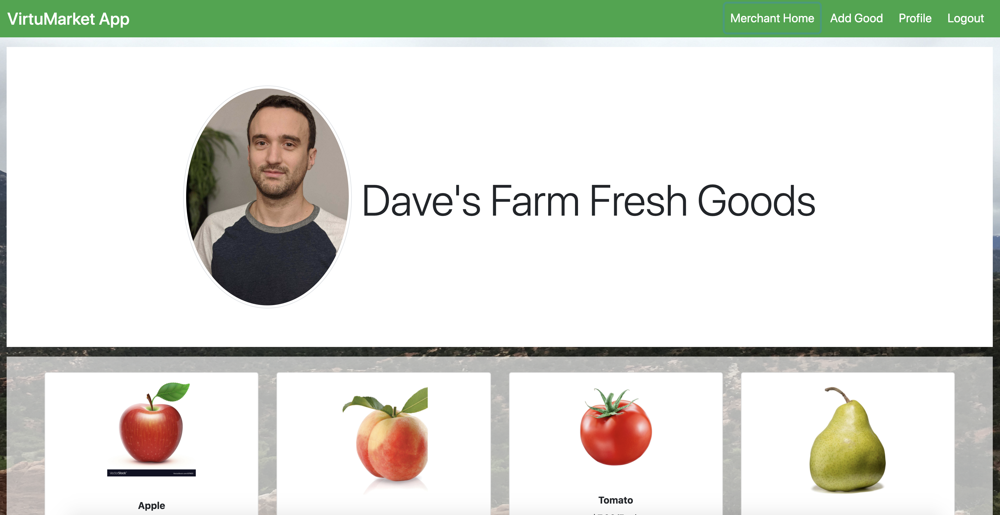
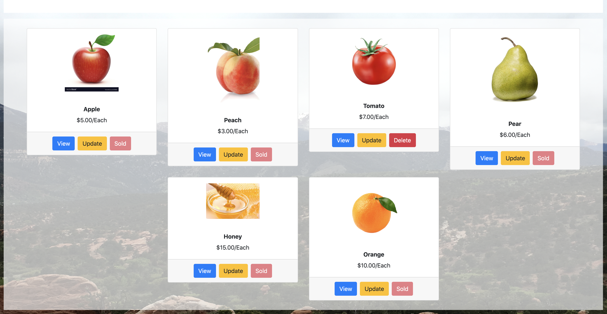
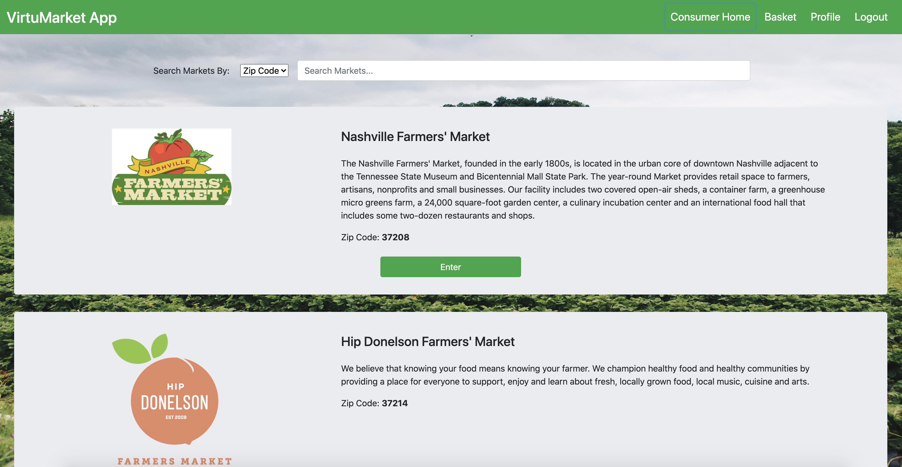
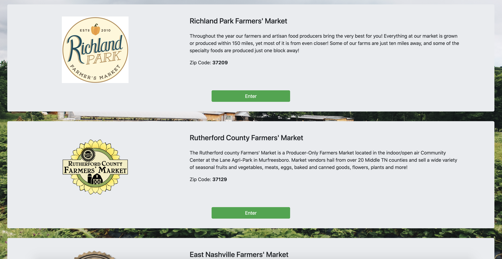
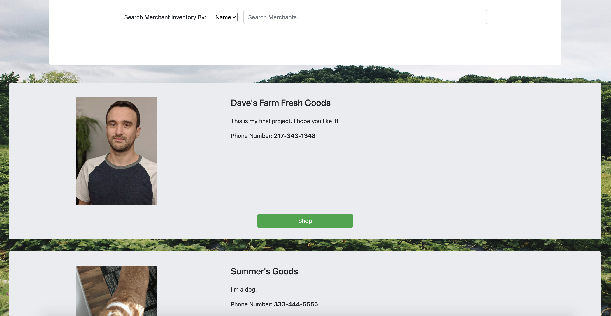
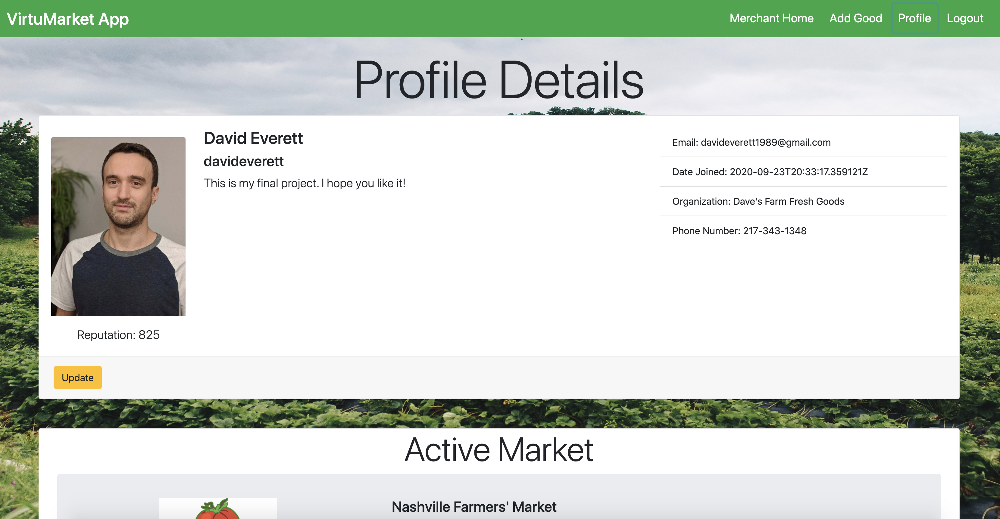
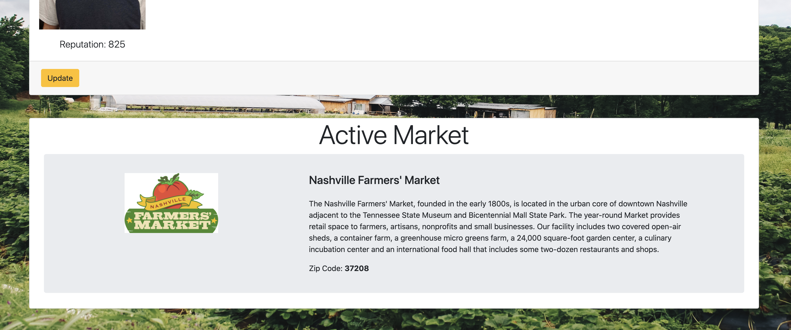
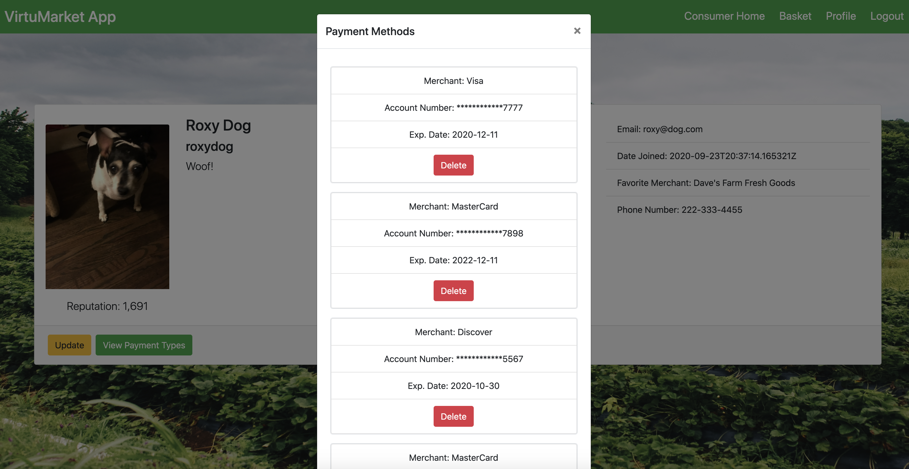
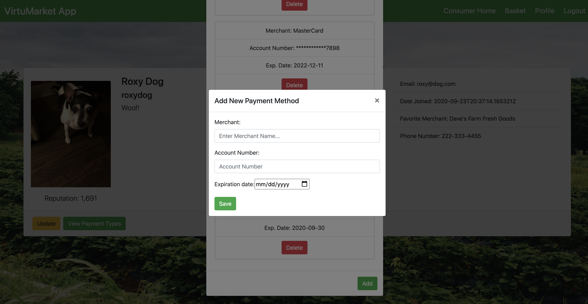

# VirtuMarket: Where Shopping Locally is a Virtue.
## Description
Virtumarket is a virtual farmer's market app that aims to connect Middle Tennessee shoppers who seek homegrown, locally sourced goods with the merchants and artisans who offer them.  

Merchants can create a profile, select their local marketplace, set up a booth with a unique background, and add the goods they have in stock.  They are also able to view and edit their profile information and change the market in which they wish to be active.

Consumers are able to create a profile, and select from a filterable dashboard of local markets.  From there, any market they select will then route them to a filterable selection of merchants from which a consumer can choose to shop.  At this point when they select a merchant, the consumer will be able to browse through any merchant's goods and add them to his or her basket.  Consumers can also update their profile information, view the payment methods they have on file, add or remove payment methods.

VirtuMarket is a full stack project split into two repositories: one that contains a client side React app for fetching and consuming API resources for user interaction, and one containing a Django REST API that exposes endpoints and serves up the requested database resources to the React client.  This is the VirtuMarket React client repository.  You can find the repository for the VirtuMarket Django REST API [HERE](https://github.com/davideverett89/virtumarket)

## Technologies Used
* SCSS
* React
* React Router DOM
* Django REST API w/Django ORM
* Cloudinary
* Bootstrap
* reactstrap

## Feature Wishlist
* App will be fully responsive and mobile friendly.
* Consumers will be able to pay for their basket/order by specifying a payment method.  They should then be routed to a confirmation page.
* Consumers will receive an emailed receipt of their order and the address for curbside pickup.
* Merchants will receive an email notification when an order has been placed.
* Merchants will be provided with an affordance to view incoming orders placed by consumers and will need to fulfill them, i.e., checking each good off on a checklist as a proof of concept akin to "boxing them up".
* Merchants will be able to navigate to a page that displays sales figures in various graphs.  Individual product performance can be viewed on the product detail page when the user is a merchant.
* Users recognized as admins or superusers will be provided with an interface that allows them to add or delete markets, product types, or unit sizes.
* Consumers will be provided with an affordance that allows them to upvote or downvote a merchant, an individual product, or both.
* Merchant reputation will be displayed on his or her profile page.
* A Consumer's most frequently shopped merchant will display on his or her profile page.
## Screenshots
### Authentication

### Registration

### Merchant Dashboard

### Consumer Dashboard
#### Market Search View

#### Merchant Search View

### Product Detail
#### Merchant View

#### Consumer View

### Create/Edit Product

### Profile Details
#### Merchant View

#### Consumer View

### Edit Profile

### View/Add Payment Methods

### Consumer Basket View

## How To Run
1. You will need to have the VirtuMarket Django REST API running locally in order for this React application to work.  Please follow those setup steps [HERE](https://github.com/davideverett89/virtumarket).
2. Clone down this repository to a local directory of your choosing.
3. `cd` into the repository and run `npm install` in your terminal.
4. At `src/helpers`, create a `apiKeys.json` file.  Paste in the object found within `src/helpers/apiKeys.example.json`.  Replace the empty string value found at the key of "apiUrl" with the following url: `http://127.0.0.1:8000`.  
5. Add `apiKeys.json` to the `.gitignore` file.
6. In your terminal, run `npm start`.  Your browser should automatically open to `localhost:3000` and the app should be up and running.  If this is not the case, run `hs -p 3000` and then navigate to [https://localhost:3000](https://localhost:3000).
